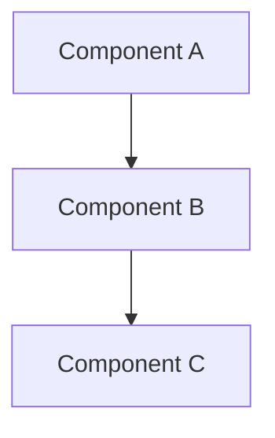

# Document Topic

Create reference documentation using subagent for research, preserving main context.

## Step 1: Find Git Root

Run `git rev-parse --show-toplevel` to locate the repository root.

## Step 2: Check Config

Read `<git-root>/.bonfire/config.json` if it exists.

**Docs location**: Read `docsLocation` from config. Default to `.bonfire/docs/` if not set.

## Step 3: Understand the Topic

The topic to document is: $ARGUMENTS

If no topic provided, ask the user what they want documented.

## Step 4: Explore the Codebase (Subagent)

**Progress**: Tell the user "Exploring codebase for [TOPIC]..."

Use the Task tool to invoke the **codebase-explorer** subagent for research.

Provide a research directive:

```
Research the codebase to document: [TOPIC]

Find:
1. **Architecture**: How this system/feature is structured, key components
2. **Key Files**: Important files and their roles
3. **Flow**: How data/control flows through the system
4. **Patterns**: Design patterns and conventions used
5. **Gotchas**: Important details, edge cases, things to watch out for

Return structured findings with file paths and brief descriptions.
```

**Wait for the subagent to return findings** before proceeding.

The subagent runs in isolated context (haiku model, fast), preserving main context for writing.

### Exploration Validation

After the subagent returns, validate the response:

**Valid response contains at least one of:**
- `## Architecture` or `## Patterns Found` with content
- `## Key Files` with entries
- `## Flow` or `## Gotchas` with items

**On valid response**: Proceed to Step 5.

**On invalid/empty response**:
1. Warn user: "Codebase exploration returned limited results. I'll research directly."
2. Fall back to in-context research:
   - `Glob("**/*[topic-related]*")` to find relevant files
   - `Grep("topic-keywords")` to find implementations
   - Read identified files
3. Continue to Step 5 with in-context findings.

**On subagent failure** (timeout, error):
1. Warn user: "Subagent exploration failed. Continuing with direct research."
2. Perform in-context research as above.
3. Continue to Step 5.

## Step 5: Create Documentation

**Naming convention**: `<topic>.md` (kebab-case)

Examples:
- `inbound-agent-architecture.md`
- `sampling-strategies.md`
- `authentication-flow.md`

Write the documentation to `<git-root>/<docsLocation>/<topic>.md`

Structure the documentation using the research findings:

```markdown
# [TOPIC]

## Overview

[What this is and why it exists - synthesized from research]

## Architecture

[How it's structured - from research findings]



## Key Files

| File | Purpose |
|------|---------|
| `path/to/file.ts` | [From research findings] |
| `path/to/other.ts` | [From research findings] |

## How It Works

[Step-by-step flow and behavior - from research]

## Usage Examples

[Code examples, CLI commands, etc.]

## Gotchas

- [From research findings]
- [Common mistakes or edge cases]

## Related

- [Link to related doc](other-doc.md)
- [Code reference]: `path/to/file.ts`
```

## Step 6: Link to Session Context

Add a reference to the doc in `<git-root>/.bonfire/index.md` under Key Resources or Notes.

## Step 7: Confirm

Summarize what was documented and ask if the user wants:
- More detail on any section
- Related topics documented
- To proceed with other work
